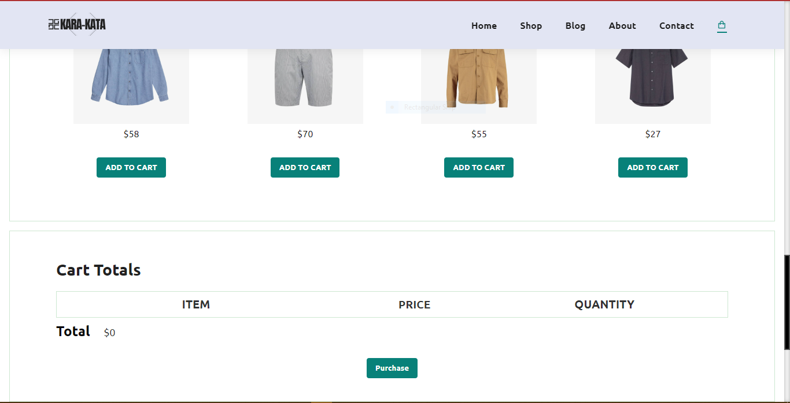
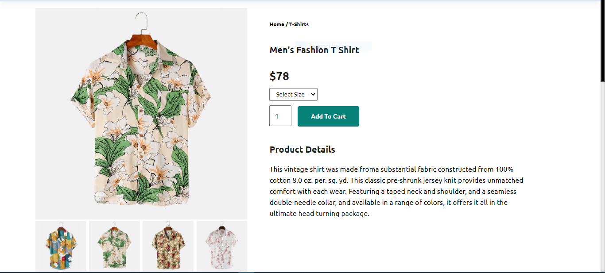

# E-Commerce Website
> This is a simple E-Commerce Website developed using HTML, CSS & JavaScript. Design inspired by Kabir Chowdhury.
> 
## Table of Contents
- [E-Commerce Website](#e-commerce-website)
  - [Table of Contents](#table-of-contents)
  - [General Information](#general-information)
  - [Technologies Used](#technologies-used)
  - [Features](#features)
  - [Screenshots](#screenshots)
  - [Video](#video)
  - [Setup](#setup)
  - [Project Status](#project-status)
  - [Room for Improvement](#room-for-improvement)
  - [Acknowledgements](#acknowledgements)
  - [Contact](#contact)
  - [License](#license)

## General Information
- Looks and feels like normal REACT E-Commerce SPAʻs, but created with just HTML, CSS & JavaScript.
- This is a lightweight, easily customizable website, youʻre welcome to fork this repo and hard a backend or as many functionality as you can.
- Be sure to acknowledge Kabir Chowdhury and [@Juadebfm](https://twitter.com/Juadeb1) .

## Technologies Used
- 1 - HTML 5
- 2 - CSS 3
- 3 - JavaScript.

## Features
Website features includes:
- Shopping cart functionalities.
- Window alerts on purchase and another when user attempt to add an already added item.
- Cart clearing as a button click.
- Responsive web design
- Mobile first approach for most of the pages.

## Screenshots

## Video
(https://www.youtube.com/watch?v=UKpdftt-KEw)

## Setup
The source codes for this codes can be used and added directly to your HTML, CSS or Javascript files.

## Project Status
Project is: _in progress_ This is an ongoing project and this is version 1 which i am submitting as CS50 final project. I intend to implement this on an actual landing page for a media company.

## Room for Improvement
**Room for improvement**:
- I believe more features can be added like the ability to permanently store this values in a database.
- Increase accesibility for tablets (Now, it's just accessible for mobile phones)

To do:
- Fix accessibility issues
- Fix SEO standards
- Create a clone project using django and react

## Acknowledgements
Honorable mentions for 9 weeks of intence knowledge impacted
- Many thanks to David J. Malan. God bless you sir.

## Contact
Created by [@Juadebfm](https://www.juadebfm.com/) - feel free to contact me!

## License 
This project is open source and available under the [@HavardCS50](https://cs50.harvard.edu/x/2022/project/).

<!-- You don't have to include all sections - just the one's relevant to your project -->